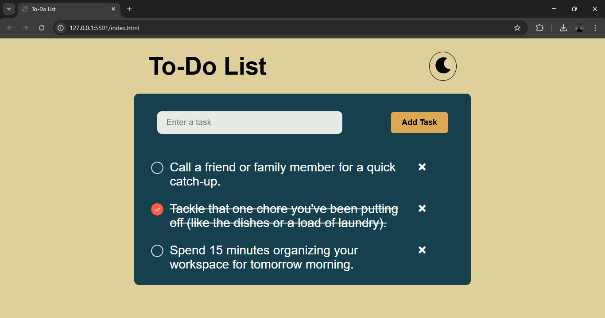

# ✅ To-Do App

A simple and interactive **To-Do application** built using **HTML, CSS, and JavaScript**.  
The app supports **CRUD operations**, **localStorage persistence**, and a **theme toggle button**.

---

## 🚀 Features

- ➕ Add new tasks    
- 🗑️ Delete tasks  
- ✅ Mark tasks as completed  
- 💾 Data stored using **localStorage**
- 🌓 Light / Dark theme toggle  
- 📱 Basic responsive design  

---

## 🛠️ Tech Stack

| Technology | Usage |
|-----------|-------|
| HTML | Structure |
| CSS | Styling |
| JavaScript (ES6) | Logic & DOM manipulation |
| LocalStorage | Data persistence |

---
## 🌐 Live Demo

 https://bhevesh31.github.io/To-Do-App/

---

## 📸 Screenshots

---

## ⚙️ How It Works

- Tasks are saved in browser **localStorage**
- All CRUD operations update both UI and storage

---

## 🚧 Future Improvements

- Task filters (All / Completed / Pending)
- Better mobile responsiveness
- Due dates & reminders

---

